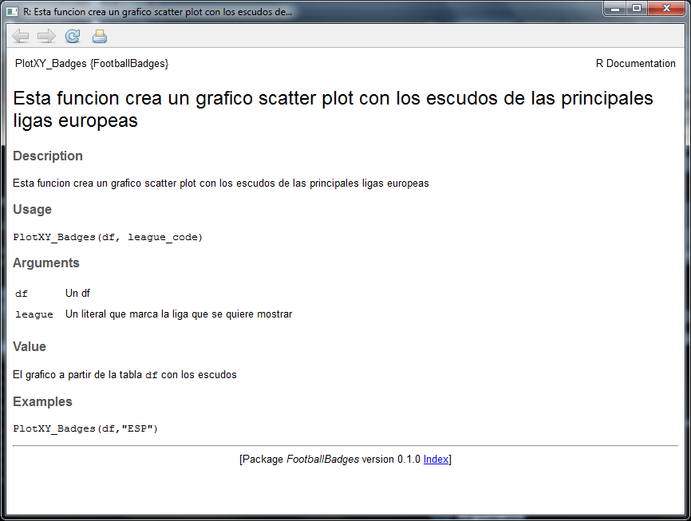
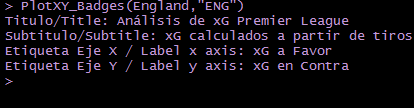
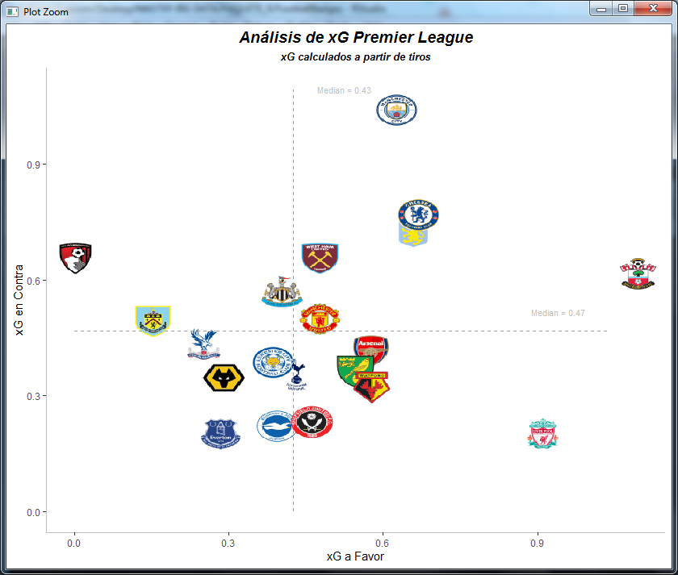
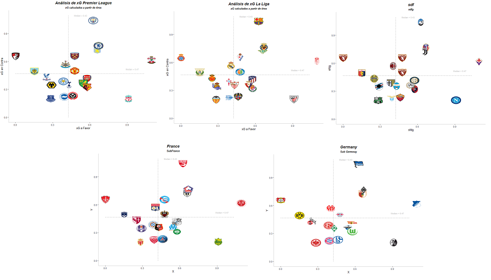

FootballBadges
================
XY Plot using badges from ENG, ESP, GER, ITA and FRA
Jesús Lagos @Vdot_spain <jelagmil@gmail.com>
2019-09-10

<!-- README.md is generated from README.Rmd. Please edit that file -->
La libreria FootballBadge esta pensada para poder hacer gráficos XY con ggplot de una manera sencilla usando los escudos de los equipos de primera de división de las principales ligas europeas.

Para poder probar las funciones de la libreria se ha instalado en `..\R\R-3.5.1\library\soccergraphR\data` los siguientes ficheros:

-   Teams.Rdata Un fichero donde consultar el listado de paises, equipos y el código que tiene que tener tu dataframe para que pinte los logos
-   Spain.RData Es un fichero con 3 columnas, donde se tiene un campo con el código de Equipo, una variable X y una variable Y-
-   De la misma manera están los ficheros France, England, Italy, Germany. 
-   Una vez instalada la libreria puedes cargar los datos directamente con:

``` r
#Para que se abra en el navegador:
data(Spain)
data(Teams)
Teams
#También puedes ver la estructura de la tabla:
?Spain
```

Versiones
=========
Versión 0.1.0 
-------------
- Versión Inicial. 

Instalación y Ayuda
-------------------

Para instalar el paquete desde Github:

``` r
devtools::install_github('jelagmil/FootballBadges', build_opts = c("--no-resave-data", "--no-manual"))
library(FootballBadges)
```
Para conocer cada función y como se usa cada una también puedes usar "?" seguido de la función para mostrar la ayuda en la pestaña de Help de RStudio. Si apretas F1 con el cursor puesto en la función también se despliega en la ayuda:

``` r
?PlotXY_Badges
```

Se vería así: 

FootballBadges
--------------

Con esta función `PlotXY_Badges(Spain,"ESP")` generarás un gráfico XY con lso escudos de cada pais para la tabla introducida. El segundo parámetro puede tomar valores "ESP", "FRA", "ENG", "ITA" y "GER"

``` r
#Puedes usar los df de prueba con data(Spain), data(England), data(Italy), data(Germany), data(France)
#Si quieres usar tu df propio comprueba en data(Teams) los códigos que tienes que tener por cada equipo
PlotXY_Badges(Spain,"ESP")
```
Una vez llamada la función en la consola nos preguntará por el:
- Título del gráfico
- Subtítulo del gráfico
- Etiqueta del Eje X
- Etiqueta del Eje Y



Y así quedaría:



Así serían los gráficos para todos los paises:



